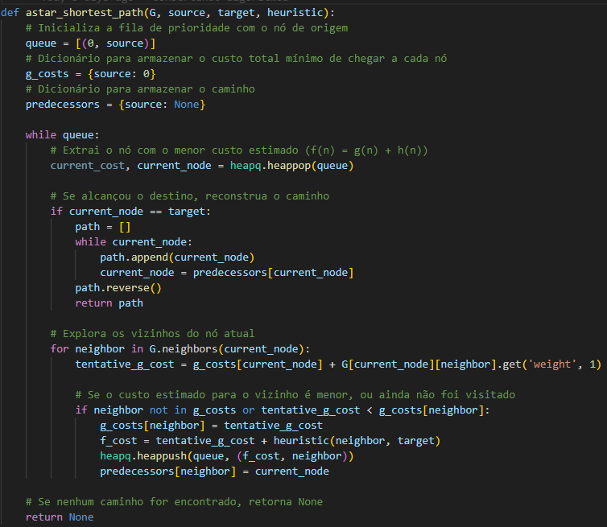
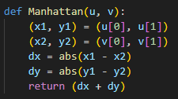
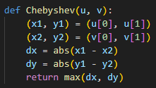
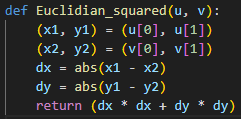

<script type="text/javascript" src="http://cdn.mathjax.org/mathjax/latest/MathJax.js?config=TeX-AMS-MML_HTMLorMML"></script>
<script type="text/x-mathjax-config">
  MathJax.Hub.Config({ tex2jax: {inlineMath: [['$', '$']]}, messageStyle: "none" });
</script>

# MazeSolvingNetworkX

A proposta deste projeto consiste na implementação dos algoritmos de **Busca em Largura (BFS)**, **Busca em Profundidade (DFS)** e **A*** com quatro heurísticas distintas, com o objetivo de realizar uma comparação de desempenho entre eles, aplicada ao problema clássico do labirinto. O problema do labirinto envolve a busca por um caminho que conecte o ponto de partida ao ponto de chegada, atravessando uma série de corredores em um mapa. Adicionalmente, foi implementada uma simulação que exibe os caminhos encontrados pelos algoritmos em um labirinto gerado aleatoriamente.

## Implementação do A*

O algoritmo A* explora um grafo sempre escolhendo o nó com o menor custo estimado (considerando tanto o custo real já percorrido quanto a estimativa restante dada pela heurística). Ele mantém registros do custo e do caminho, e ao encontrar o destino, reconstrói o caminho mais curto.



Esse código implementa o algoritmo A* para encontrar o caminho mais curto em um grafo ponderado, do nó de origem (`source`) ao nó de destino (`target`), utilizando uma função de heurística. Vamos detalhar os principais pontos:

### Incialização

```
queue = [(0, source)]
g_costs = {source: 0}
predecessors = {source: None}
```

- `queue`: uma fila de prioridade (heap), onde cada elemento é um par `(f(n), node)`, onde `f(n)` é o custo total estimado para chegar ao destino através de `node`. Inicialmente, ela contém apenas o nó de origem com custo `0`.
- `g_costs`: um dicionário que guarda o menor custo real de chegar a cada nó a partir da origem (`g(n)`).
- `predecessors`: armazena o caminho percorrido, onde cada nó aponta para seu predecessor.

### Loop Principal

```
while queue:
    current_cost, current_node = heapq.heappop(queue)
```

- Enquanto a fila não estiver vazia, o nó com o menor custo estimado é removido da fila (usando `heapq.heappop`, que garante a extração do menor custo).

### Verificaçã de Destino

```
if current_node == target:
    path = []
    while current_node:
        path.append(current_node)
        current_node = predecessors[current_node]
    path.reverse()
    return path
```

- Se o nó atual for o destino (`target`), o código reconstrói o caminho percorrendo o dicionário `predecessors` desde o nó de destino até o de origem. Em seguida, o caminho é invertido (para começar da origem) e retornado.

### Expansão dos Vizinhos

```
for neighbor in G.neighbors(current_node):
    tentative_g_cost = g_costs[current_node] + G[current_node][neighbor].get('weight', 1)
```

- Para cada nó vizinho do nó atual, calcula-se o custo provisório (`tentative_g_cost`) para chegar a esse vizinho a partir do nó atual. Esse custo é o custo atual `g(n)` somado ao peso da aresta entre os dois nós (assumido como 1 se não especificado).

### Verificação e Atualização de Custos

```
if neighbor not in g_costs or tentative_g_cost < g_costs[neighbor]:
    g_costs[neighbor] = tentative_g_cost
    f_cost = tentative_g_cost + heuristic(neighbor, target)
    heapq.heappush(queue, (f_cost, neighbor))
    predecessors[neighbor] = current_node
```

- Se o vizinho ainda não foi visitado (`neighbor not in g_costs`) ou o novo custo provisório é menor que o custo registrado anteriormente, o algoritmo atualiza o custo do vizinho em `g_costs`.

- Calcula o custo total estimado `f(n) = g(n) + h(n)`, onde `h(n)` é o valor da heurística fornecida pela função `heuristic`.

- O vizinho é adicionado à fila de prioridade com esse novo custo, e o nó atual é registrado como predecessor do vizinho.

### Retorno Alternativo

```
return None
```

- Se a fila for esvaziada e o destino não for alcançado, o algoritmo retorna `None`, indicando que não há caminho possível entre origem e destino.

## Heurísticas

- **Manhattan**: Adequada para movimentos ortogonais, soma as distâncias em cada eixo.

- **Chebyshev**: Ideal para movimentos em todas as direções, retorna a maior diferença em um dos eixos.

- **Euclidiana**: Utilizada para calcular a distância reta entre dois pontos, aplicando o Teorema de Pitágoras.

- **Euclidiana ao Quadrado**: Uma versão da heurística Euclidiana sem a raiz quadrada, mais eficiente para comparação direta.

### Manhattan



Calcula a soma das diferenças absolutas das coordenadas x e y entre os pontos u e v.

Essa heurística é utilizada normalmente em situações onde o movimento é restrito a direções ortogonais (norte, sul, leste, oeste), como em grades ou mapas urbanos, daí o nome "Manhattan", referenciando o sistema de ruas ortogonal de Nova York.

$$
d_{Manhattan} = |x_1 - x_2| + |y_1 - y_2|
$$

### Chebyshev



Retorna o maior valor entre as diferenças absolutas das coordenadas x e y dos dois pontos.

A heurística de Chebyshev é utilizada normalmente em ambientes onde o movimento diagonal é permitido, como em jogos de tabuleiro ou mapas onde o movimento pode ser feito em oito direções (norte, sul, leste, oeste e diagonais).

$$
d_{Chebyshev} = max(|x_1 - x_2|, |y_1 - y_2|)
$$

### Euclidiana


Calcula a distância "em linha reta" entre dois pontos no espaço bidimensional, utilizando o Teorema de Pitágoras.

A heurística Euclidiana é apropriada em situações onde o movimento é contínuo e pode ocorrer em qualquer direção (não restrito a direções ortogonais ou diagonais).

$$
d_{Euclidiana} = \sqrt{(x_1 - x_2)^2 + (y_1 - y_2)^2}
$$

### Euclidiana ao Quadrado



Calcula a distância ao quadrado entre dois pontos, eliminando a raiz quadrada da fórmula Euclidiana.

Essa heurística é usada quando não há necessidade de calcular a raiz quadrada para otimização (já que comparar distâncias ao quadrado dá o mesmo resultado que comparar as distâncias reais, mas sem o custo computacional da raiz).

$$
d_{Euclidiana^2} = (x_1 - x_2)^2 + (y_1 - y_2)^2
$$

## Execução

Para gerar um labirinto, é necessário executar o arquivo ***maze-generator.py***, especificando a quantidade de labirintos a serem gerados com dimensões fixas de 11x11, 21x21, 31x31, 41x41 ou 51x51. Os labirintos gerados serão automaticamente salvos na pasta mazes. Abaixo, segue um exemplo de execução, onde 50 labirintos serão gerados:

```
python src/maze-generator.py 50
```

Para testar todos os algoritmos, execute o arquivo ***main.py*** especificando a quantidade de labirintos a serem testados com dimensões de 11x11, 21x21, 31x31, 41x41 ou 51x51. Ao final da execução, será solicitado o nome do arquivo onde os resultados serão armazenados. Este arquivo será salvo na pasta datas. Abaixo segue um exemplo de execução para testar 50 labirintos:

```
python src/main.py 50
```

Para visualizar a simulação dos caminhos encontrados pelos algoritmos, execute o arquivo ***maze-show-path.py***, especificando o tamanho de um lado do labirinto quadrado. Abaixo, segue um exemplo de execução para visualizar um labirinto com dimensões de 51x51:

```
python src/maze-show-path.py 51
```